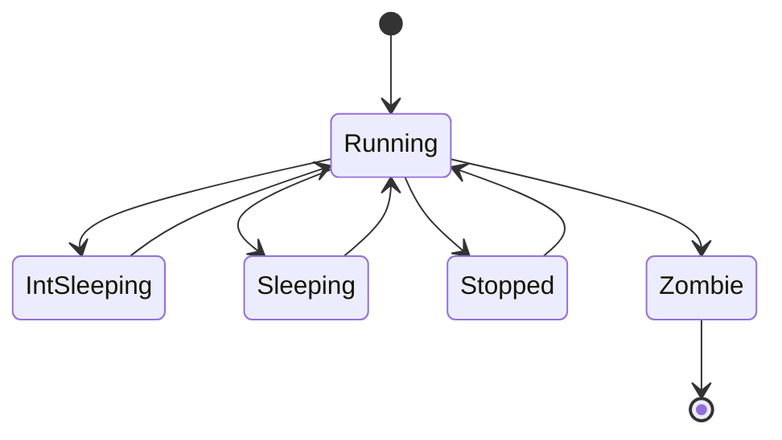

# Process

A process is a program being executed by the kernel. Each process has a unique PID which is allocated at creation.

## State

A process can have the following states:

| Name          | Shorthand | Description                                                                                     |
|---------------|-----------|-------------------------------------------------------------------------------------------------|
| `Running`     | `R`       | The process is currently running or is ready to be resumed by the scheduler                     |
| `IntSleeping` | `S`       | The process is waiting on a resource to become available, but can get resumed by a signal       |
| `Sleeping`    | `D`       | The process is waiting on a resource to become available, ignoring signals (usually during I/O) |
| `Stopped`     | `T`       | The process has been paused by a signal                                                         |
| `Zombie`      | `Z`       | The process has been terminated and cannot resume, ever                                         |

The `Running` state is the only state in which a process can be executed.

The following state transitions are valid:

