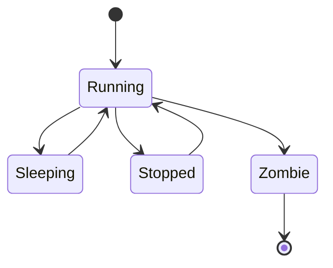

# Process

A process is a program being executed by the kernel. Each process has a unique PID which is allocated at creation.

## State

A process can have the following states:

| Name       | Shorthand | Description                                                                               |
|------------|-----------|-------------------------------------------------------------------------------------------|
| `Running`  | `R`       | The process is currently running or is ready to be resumed by the scheduler               |
| `Sleeping` | `S`       | The process is waiting on a resource to become available (usually I/O or another process) |
| `Stopped`  | `T`       | The process is paused                                                                     |
| `Zombie`   | `Z`       | The process has been terminated and cannot resume, ever                                   |

The `Running` state is the only state in which a process can be executed.

The following state transitions are valid:

## Scheduler

The scheduler preempts execution of the currently running process to switch context to another process in its run queue, in order to share CPU-time across processes. Each CPU core has its own scheduler.

When a process transitions into `Running` state, it is inserted into the run queue of a scheduler. The kernel attempts to balance processes across CPU cores.

Likewise, when a process transitions into another state than `Running`, it is **dequeued** (removed from its run queue).

Context switching can be triggered by a timer interrupt or when waiting for a resource to become available (for example).
It can also be triggered manually by calling `schedule`.

If there is no process in a scheduler's run queue, it shall switch to the **idle task**, which is a kernel thread with PID `0` that puts the CPU in idle state.

### Critical sections

Sometimes, we want to be able to process interrupts, but prevent the scheduler from preempting the process.

In order to achieve this, we have to use **critical sections**.
A critical section is entered by calling `preempt_disable`, and is exited by calling `preempt_enable`. To ensure correctness, one should prefer using the `critical` function.

Note that:
- `preempt_enable` or `critical` may preempt the execution context before returning
- calling `schedule` inside a critical section is invalid (for obvious reasons)

Critical sections can be nested. This is handled with a per-CPU counter.
